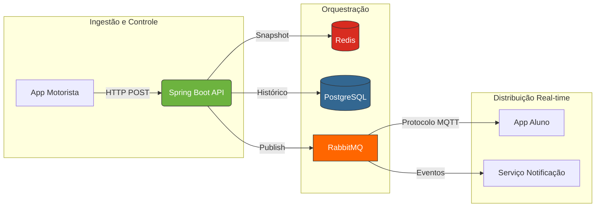

# 🚀 Zygo | Monitoramento para viagens universiátias

Bem-vindo ao repositório de documentação do **Zygo**. Este espaço detalha as decisões de engenharia, padrões de arquitetura e a stack tecnológica utilizada na construção de uma plataforma SaaS voltada para a gestão e rastreio geolocalizado de frotas universitárias.

---

## 📌 Visão Geral: O Problema
Atualmente, alunos que dependem do transporte universitário vivem "reféns" de si mesmos devido a um fluxo de informações ineficiente e manual:

* **Dependência de Mensagens:** Necessidade de compartilhar localizações manualmente e perguntar constantemente em grupos sobre o paradeiro do transporte.
* **Vigilância Constante:** O usuário precisa estar 100% atento até o transporte chegar; qualquer distração resulta na perda da viagem e prejuízos financeiros (como, por exemplo, precisar pedir um Uber para deslocação).
* **Invisibilidade Logística:** Gestores e autoridades do sistema de transporte carecem de dados sobre trajetos ou performance, dificultando a administração do serviço e melhoria constante do mesmo.

---

## 💡 A Solução
O **Zygo** vem com a premissa de eliminar a dependência de mensagens manuais e a vigilância constante, centralizando as responsabilidades no sistema com poucos cliques. Algumas das funcionalidades destaque do **Zygo**:

1. **Mapa em Tempo Real:** Visualização instantânea via streaming de dados, permitindo autonomia total ao aluno.
2. **Notificações Inteligentes:** Pushs automáticos informando distância do veículo, desvios de rota, imprevistos ou trânsito lento.
3. **Histórico e Telemetria:** Registro granular de cada metro percorrido, permitindo auditoria de rotas e análise de eficiência logística.
4. **Gestão Analítica:** Dashboards para gestores com relatórios sobre viagens, motoristas e frequência de alunos, transformando cada viagem em uma operação baseada em dados reais.

---

## 🏗️ Arquitetura do Sistema
O **Zygo** utiliza uma arquitetura baseada no Event-Driven-Design (EDD), utilizando RabbitMQ com o protocolo MQTT para sustentar o fluxo de dados em tempo real, garantindo a entrega estratégica e eficiente da telemetria aos usuários finais. 

### ⚡ Engenharia e Fluxo de Dados
* **Orquestração de Mensageria (RabbitMQ and MQTT protocol):** Utilização do RabbitMQ como Message Broker central, convertendo dados de telemetria via protocolo MQTT para entrega eficiente em dispositios móveis.
* **Processamento dos dados:** Spring Backend robusto responsável pela validação da viagens, gestão de life-cycle e despacho de eventos de localização, coleta de métricas de cada viagem, authenticação da aplicação e de conexão ao Message Broker, envio de notificações dinâmicas aos alunos com base nos dados das viagens e etc.
* **Streaming com MapBox API:** Integração com a MapBox para geração de rotas, cálculo de ETA (tempo estimado de chegada), validação de dados de coordenadas e renderização de geometria do trajeto.
* **Persistência (PostgreSQL & Redis):** Redis agindo como cache de altissíma velocidade para lidar com "estados atuais", como em dados de posições. PostgreSQL usado para armazenamento de longo prazo para histócio de pings (breadcrumbs), usuários em geral e relatórios de cada viagem.
* **Comunicação em Real-Time:** Fluxo hibrído de ingestão de dados via REST/HTTP, e distribuição ocorrendo via Websockets/MQTT, garantindo escalabilidade, seguraça e resiliência para cargas de milhares de conexões simultâneas.

---
### 🛠️ Backend Stack
* **Linguagem:** Java
* **Framework Principal:** Spring Boot, Spring Data Jpa, Spring Security, Spring AMQP, Hibernate, slf4j (logging), Swagger
* **Mensageria:** RabbitMQ (com protocolo MQTT)
* **Bancos de Dados:** PostgreSQL, Redis
* **Integração de Mapas:** MapBox API
* **DevOps:** Docker & Docker Compose
* **Migrações:** Flyway

---

---

**⚖️ Direitos Autorais e Licença**  
Este projeto é um **produto proprietário**. todos os direitos de propriedade intelectual são reservados. A reprodução, distribuição ou modificação sem autorização expressa é proibida.

Desenvolvido e mantido por **Iago**

